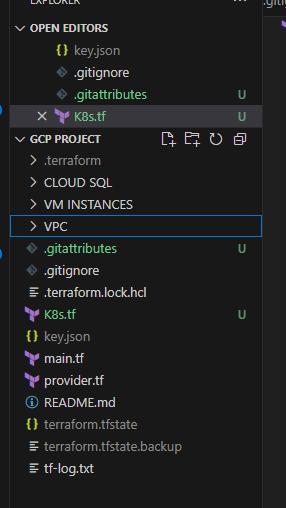
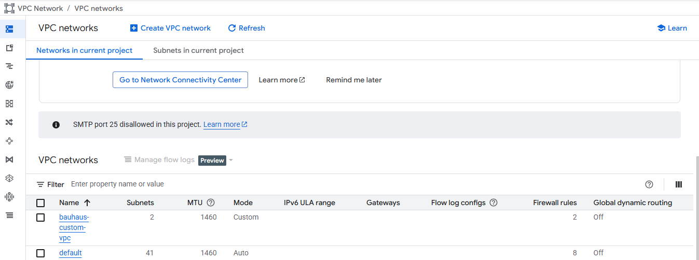
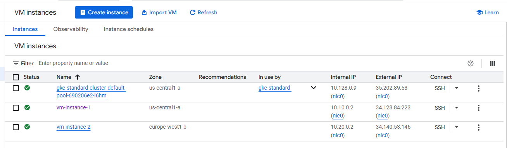
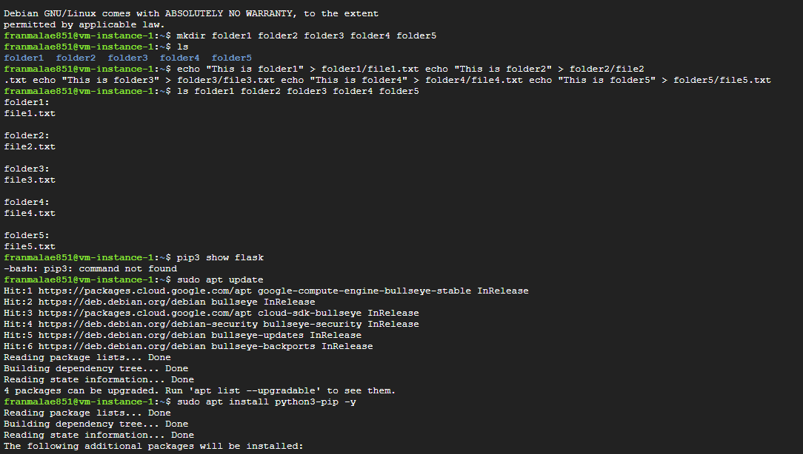
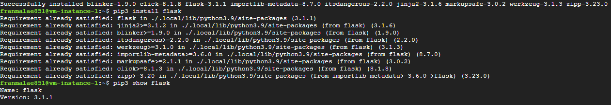
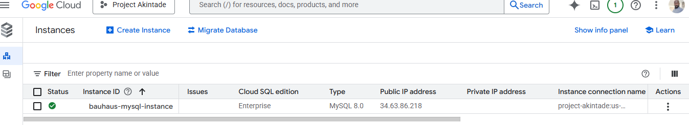
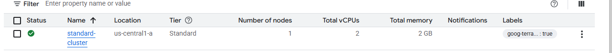
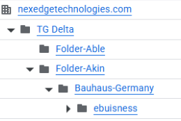
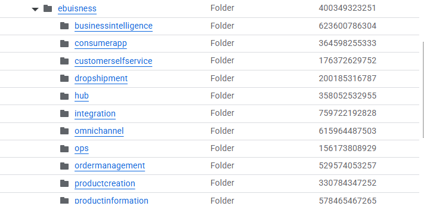
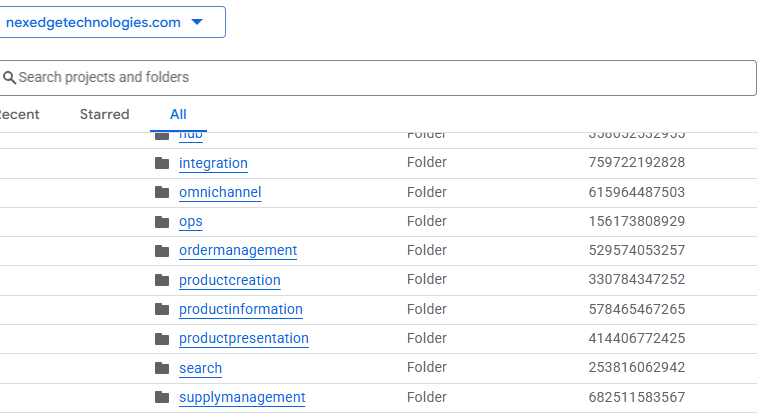

GCP End-of-Training Project – Infrastructure Deployment using Terraform

Objective

To demonstrate proficiency in setting up infrastructure on Google Cloud Platform (GCP) using core services such as VPC, VM instances, IAM roles, Cloud SQL, Kubernetes, Linux, and Infrastructure as Code (IaC) via Terraform. This project also utilizes GitHub for version control and documentation.

Project Structure

The project is organized with Terraform configuration files and supporting folders. All deployments were handled via VS Code.

 VPC Network Setup

A custom VPC network was provisioned using Terraform, with 2 subnets in different GCP regions (europe west1 and us central1). Firewall rules were added to allow:
- HTTP (port 80)
- HTTPS (port 443)
- SSH access (port 22) from  0.0.0.0/0

VM Instances

Two Compute Engine instances were deployed—one in each subnet of the custom VPC. These instances serve as compute nodes for application testing and Linux demonstrations.

Identity & Access Management (IAM)

Roles were assigned using the GCP Console:
- Compute Admin and Compute Network Admin permissions were granted to a user

Linux Demonstration

Basic Linux commands were demonstrated on one of the VMs:
- Created 5 folders using mkdir
- Added one `.txt` file into each folder using `touch`
- Verified the structure with `ls -R`

🐍 Flask Application Deployment

A simple Python Flask app was deployed inside the fifth folders on the VM. It was used to confirm Python and Flask were installed and running.

Cloud SQL (MySQL) Setup

A MySQL instance was provisioned using GCP Console.
- A sample database and table were created with test data.
- Screenshots of both the instance and table entries were captured.

Cloud SQL Instance

MySQL Table Entries

☸️ Kubernetes Cluster (GKE)

A standard Kubernetes cluster was provisioned using Terraform. This setup can support microservices or containerized app deployments in future phases.

🔐 Folder Structure on GCP (Organization Hierarchy)

Inside the GCP Organization (`NexEdge Technologies`):
- Created a folder named `Bauhaus Germany`
- Nested a department folder: `ebusiness`
- Within `ebusiness`, created team folders via Terraform:
  - `hub`, `ops`, `search`, `ordermanagement`, `businessintelligence`, `supplymanagement`, `productcreation`, `integration`, `omnichannel`, `consumerapp`, `customerselfservice`, `productpresentation`, and `productinformation`
  
  
  

 ✅ Summary

This project successfully demonstrates:

- Provisioning GCP infrastructure using **Terraform**
- Managing access with **IAM**
- Running Linux commands on VMs
- Deploying apps with **Flask**
- Working with **Cloud SQL**
- Creating and configuring a **Kubernetes** cluster
- Organizing cloud resources by **folders and departments**
- Version control with **GitHub**

Contributor

- **Name:** [Aduroja Akintade]
- **Email:** abel-yakubu added as a contributor to this repository

📌 Notes

All images used here were captured during the hands-on implementation. Terraform state files and credentials have been safely ignored via `.gitignore`.

